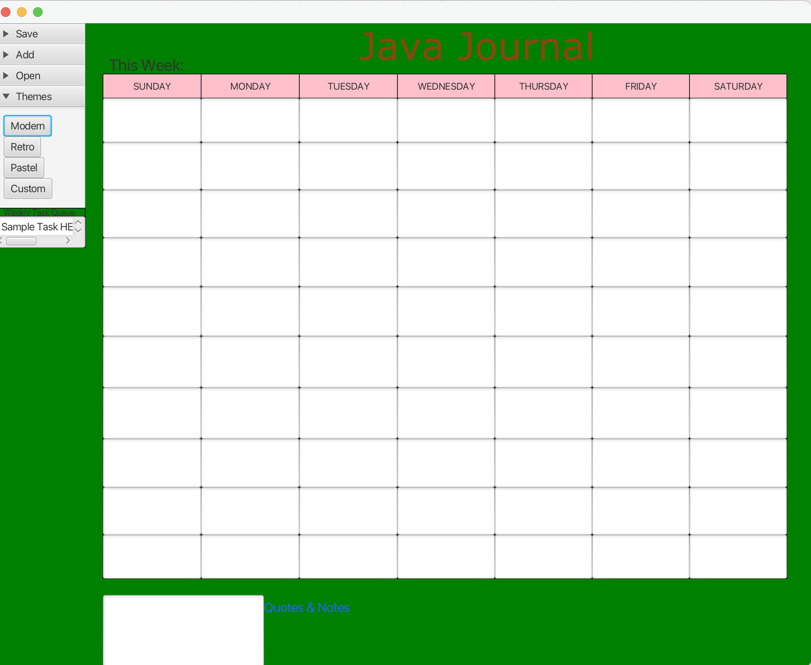
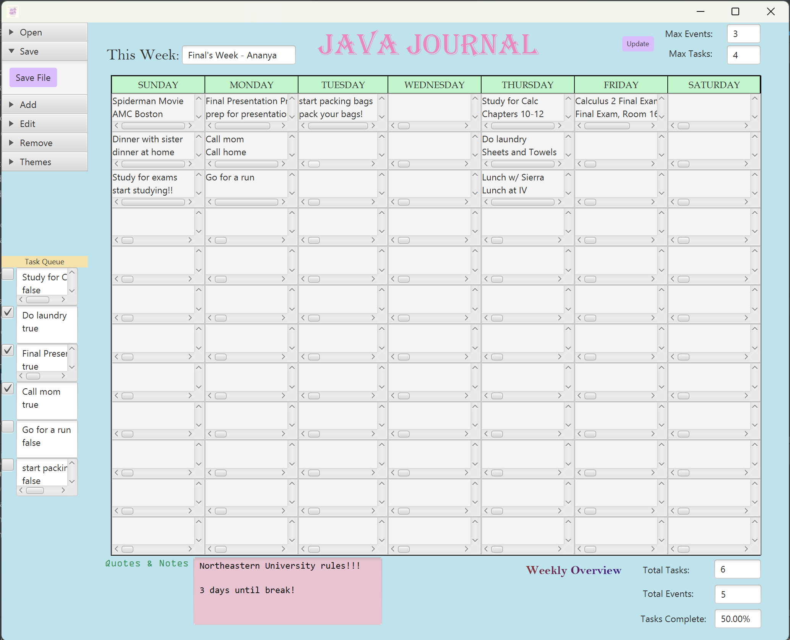

# 3500 PA05 Project Repo

[PA Write Up](https://markefontenot.notion.site/PA-05-8263d28a81a7473d8372c6579abd6481)

# Program Pitch:

## JAVA JOURNAL presented by officehours4lyfe-1
- Welcome to the Java Journal
- This is an application that allows users to keep track of tasks, events, notes, important information, and statistics about their daily lives
- With this application, users can easily track their upcoming events, see their tasks in a handy task queue, and see their weekly statistics
- When starting the program, the user is given the ability to 
  
  - open a Java Journal .bujo file
    - We allow the user to look through their file explorer for a .bujo file which 
    - can then be used within the application as a pre-existing bujo file

  - save a Java Journal .bujo file
    - The user can save a Bullet Journal session to a .bujo file and save their progress
    - This also allows them to open up this file at a later point
    - This file saves all the information that the user input within the file including:
    - the week name, the max number of events set, the max number of tasks set, 
    - any quotes and notes written down by the user, all the tasks and events added 
    - to the calendar view, and any edits made during this session
    
  - Add tasks and events
    - Users can add tasks and events to their calendar and track their week
    - The tasks can also be viewed from the Task Queue
    
  - edit tasks and events
    - We understand that life moves at a unique pace for everyone and that plans
    - can change. This is why users have the ability to edit their tasks and events.
    - These tasks are also updated within the Task Queue and the statistics section
    - also reflects these changes
  
  - remove tasks and events
    - along with editing tasks and events, users also have the ability to remove
    - them from their calendar view, task queue, and weekly statistics view
  
  - setting a max number of tasks and events
    - since we want bullet journaling to be a therapeutic and relaxing experience,
    - we did not want to overwhelm the user with too many options of functionalities.
    - this is why we allow the user to set a maximum number of tasks and events for the 
    - week. doing so can help users understand how their time is spent on a weekly basis
    - and reflect on what the things they have spent time on affect them, both positively
    - and negatively
    
  - choose from built-in themes 
    - We are firm believers in the power of creativity and the expression of individuality
    - our Java Journal product reflects this as well. Users can choose from three built-in themes
    - which are varied and enhance the bullet journal experience. 
    
  - develop their own color scheme theme
    - If users would like to do so, they can also customize their own themes
    - by choosing from a variety of colors for fonts, backgrounds, and sections 
    - of the journal
    
  - Weekly Overview
    - in order to provide users with a helpful summary of their week, the Java Journal
    - takes into account the total number of tasks and events that a user tracks
    - as well as whether tasks are completed or not
    - this can help users easily keep track of how their time is being spent
    - and the progress they have made on tasks they have set
    
  -  Task Queue
    - to create a streamlined view of the tasks a user should complete in a week,
    - we provide a helpful display on the side that also allows users to check off
    - whether these tasks have been completed
    - while the calendar view is helpful, we also want to provide users with
    - a quick and easy way to view their agenda for the week

  - Week view:
    - the user can see the full display of their events and tasks within a weekly
    - calendar view
    - this allows users to plan out where they would like to achieve tasks as well as
    - to keep track visually of their schedule for the week

- As bullet journaling is a fun and effective way to organize your life, the Java Journal will be a useful tool for users that promotes productivity, organization, and fun!
- Buy our application today in order to invest in a well-organized life that you can easily track!

### Why use the Java Journal?
- Our product offers a clean yet simple design that is easy for minimalists 
- and beginners to use. 
- We offer a great amount of personalization and practical functionality for users
- Users can save their progress and revisit old files and weeks at any time
- Handy task queue viewer that allows users to see all of their tasks for the week and mark them as complete
- the ability to edit and delete tasks and events, allowing for flexibility and room for changes

## Reviews from users:
- "This journal is gorgeous and clean, it is minimalistic while still
- allowing me to individualize it to my preferences. I have always struggled
- with time management, but with the Java Journal, I can
- easily track my progress and upcoming events!"

- "This Java Journal has been a super cool way for me to delve 
- into the world of bullet journaling. I like how the options are 
- plentiful but don't overwhelm users. It keeps things simple yet effective."

- "If you are looking to get into bullet journaling or even tracking your daily progress, 
- look no further than the Java Journal. It was recommended to me by a friend and
- I have used it every day since then. I love how I can save files and have a clean slate
- every week. I really enjoy this product and highly recommend it!"

# GUI Screenshots of Features

# SOLID Principle Approach

## S - Single Responsibility:
- The Single Responsibility Principle was applied to this project specifically within the Controller class. 
- We had a Controller that called a run method along with handlers for when buttons were clicked and actions 
- were taken by the user within the GUI. When actions were taken by the user within the GUI, we dispatched to 
- handler classes also within the Controller package. Handlers that our program had included handlers for file
- creation, task creation, event creation, task editing, event edition, task deletion, event deletion,
- for choosing theme options, and for opening files.

## O - Open-Closed Principle
- The Open-Closed Principle was applied to our program through our use of abstraction and 
- interfaces within the controller package. We made an Abstract Handler class that displays 
- an error alert, since this container was used in a large number of our classes to 
- account for situations that the user should not reach. To prevent code duplication and be
- open for extension within our handler classes, we decided to abstract this method and place
- it within an abstract class which was then extended to some of our handler classes

## L - Liskov's Substitution Principle
- Liskov's Substitution Principle was utilized within our program within the BujoItem class and 
- the Task and Event subclasses. The BujoItem class is the parent class which consists
- of the shared fields within the Task and Event classes. The Task and Event classes are the 
- subclasses of the BujoItem class and extend the shared fields of the BujoItem class. The
- functionality of the BujoItem class is then able to be extended to the Task and Event classes, 
- removing code duplication and abstracting out the shared behavior of the classes

## I - Interface Segregation Principle
- Our application uses the Interface Segregation Principle by using a Controller interface
- and a JournalView interface. These interfaces allow us to separate the functionality of
- different classes while allowing similar classes that share fields and methods to be more 
- streamlined and succinct, removing code duplication and making sure that clients are not 
- forced to implement uneccessary functions. 

## D - Dependency Inversion Principle
-  Our application uses the Dependency Inversion Principle through our use of a 
- Controller interface, AbstractHandler abstract class, and JournalView interface.
- Because we wanted our classes to be open for extension and to allow us the ability to
- implement other features within our program, we abstracted and created interfaces.

# Additional Features: Menu Bar and Shortcuts
- We could extend our program to add the feature of the Menu Bar and Shortcuts, which was
- was something we did not implement for the Beta release of our program. Currently,
- the buttons and FX controls for our program are largely stored within an Accordion which could
- instead be represented as a MenuBar with buttons inside of it. Since this was created through SceneBuilder,
- it would not programmatically change how the buttons are handled within our program. If we also decided to 
- keep the Accordion feature as well as implement a MenuBar, we could add the MenuBar to the bottom or the top
- of our Java Journal and have buttons that implement the same handlers or have this be abstracted. After placing 
- the buttons inside of the MenuBar, we could implement the shortcuts using listeners that listen for key events to be 
- performed by the user. We should also make sure that the shortcuts can be supported by both Macbook
- users and Windows computer users, so when implementing shortcuts, we should listen for "Command" + Key
- as well as "Ctrl" + Key. We would also have to create handlers within our controller package to deal with 
- the delegation of the action that should take place once a user either presses a button or uses a shortcut
- within the application. By doing all of this, we would be able to implement the Menu Bar and Shortcuts feature.

# Image Attribution
- Default Theme Icon Source:
  - https://www.pinterest.com/pin/11610911537815154/
- Modern Theme Icon Source:
  - https://www.pinterest.com/pin/2040762325596439/
- Pastel Theme Icon Source:
  - https://www.luamaralstudio.com/product/flower-poster-danish-pastel-aesthetic-image-for-wall-collage-and-creative-projects/
- Retro Theme Icon Source: 
  - https://www.pinterest.com/pin/9288742974515328/